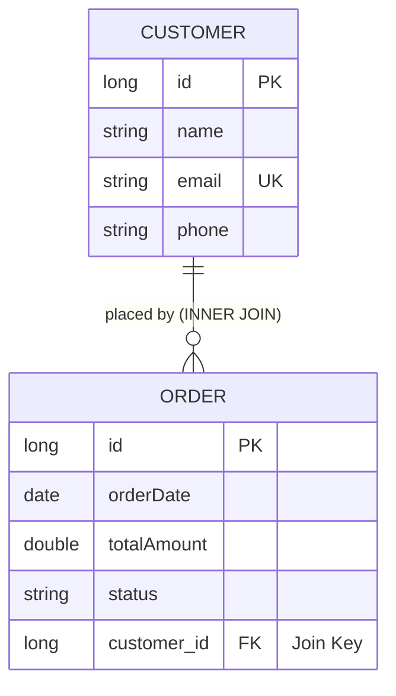

# Customer Order Management System

This project provides a professional application for managing customer data and their associated orders. It implements a robust one-to-many data model and follows a layered architecture (Controller, Service, Repository, Entity) to ensure clean separation of concerns and maintainability.

## Project Description

The application is built using the Spring Boot framework and manages two primary entities: Customers and Orders. A customer can place multiple orders, and each order is associated with exactly one customer. The system ensures data integrity through validation constraints and unique identifiers for customer emails.

## Database Schema and ER Diagram

The persistence layer is managed by H2 in-memory database by default for easy setup. The relationship between customers and orders is implemented using a foreign key `customer_id` in the `orders` table.



### Table Definitions

1.  **Customers**: Stores customer profile details including name, unique email address, and phone number.
2.  **Orders**: Stores transaction details including order date, total amount, and fulfillment status. Linked to a specific customer via `customer_id`.

## Technology Stack

*   **Backend**: Spring Boot 3.2.2, Java 17
*   **Data Access**: Spring Data JPA (Hibernate)
*   **Database**: H2 (In-Memory)
*   **Web Layer**: Spring MVC with JSP templates (JSTL)
*   **Styling**: Vanilla CSS with modern aesthetics

## Installation and Setup

### Prerequisites

Ensure the following tools are installed on your system:
*   Java Development Kit (JDK) 17
*   Maven 3.8 or higher (or use the provided Maven wrapper)

### Local Setup

1.  Clone the repository or navigate to the project root directory.
2.  Open a terminal in the project root.
3.  Execute the application using the Maven wrapper:
    ```bash
    ./mvnw spring-boot:run
    ```
4.  The application will be accessible at: `http://localhost:8080`
5.  Sample data (10 customers and 10 orders) is automatically seeded on startup via `DataLoader`.

### H2 Console

You can inspect the in-memory database at:
*   URL: `http://localhost:8080/h2-console`
*   JDBC URL: `jdbc:h2:mem:customer_order_db`
*   User: `sa`
*   Password: (leave blank)

## Development and Testing

Unit and integration tests are located in `src/test`. These tests cover repository operations, service layer logic (including duplicate email handling), and the custom join query.

To execute the test suite, run:
```bash
./mvnw test
```

## Features

*   **Customer CRUD**: Create, Read, Update, and List customers.
*   **Order CRUD**: Create, Read, Update, and List orders with customer selection.
*   **Joined Data View**: A specific view demonstrating an INNER JOIN query to fetch orders along with detailed customer information.
*   **Validation**: Server-side validation with user-friendly error messages on JSP pages.
*   **Global Exception Handling**: Centralized handling for entity not found and data integrity violations.
